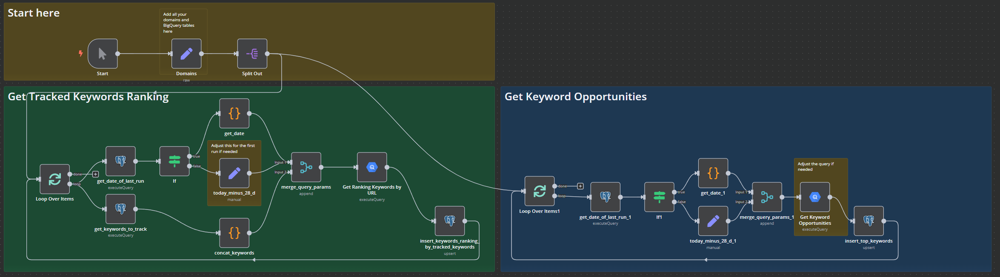
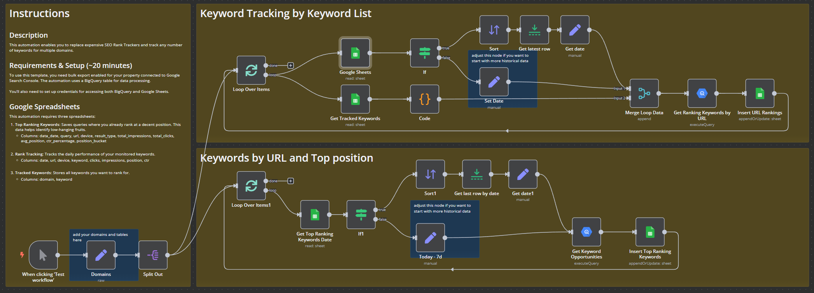

# Free Rank Tracker

A free n8n automation to track unlimited keywords for unlimited websites.

## Rank Tracker Postgres

## Rank Tracker Google Sheets

## Overview

This repository provides a free rank tracker that allows you to track unlimited keywords for as many websites as you like. It automates the process of keyword rank tracking, saving you time and effort compared to manual checks or expensive SEO tools.

## Why Use This Template?

Most SEO tools for rank tracking are:
- Expensive
- Limited to the amount of websites
- Restricted in the number of keywords or websites

This automation solves these problems by providing unlimited tracking capabilities for free.

## Features

- Track unlimited keywords
- Monitor multiple websites
- Identify low-hanging fruits for content optimization
- Automated data collection
- No gaps in data tracking
- Flexible date range settings

## Setup Instructions

### Initial Setup

1. Set the date range in edit-nodes (marked with stickers)
   - Default: Uses data from 7 days ago
   - Adjustable for more historical data

### Dynamic Updates

After initial setup, the system:
- Automatically sets date ranges
- Uses the last available date from keyword tracking
- Ensures continuous data collection without gaps
- Works even without scheduled runs

### Google Spreadsheets Setup

1. Follow node instructions for spreadsheet creation
2. Copy and paste required columns
3. Name your spreadsheets
4. Add your credentials

## Advanced Usage

While this automation works well with Google Sheets, PostgreSQL integration is available for:
- Better performance with large datasets
- AI agent integration
- Advanced data analysis

Both workflows (Google Sheets and PostgreSQL) are available in this folder.
