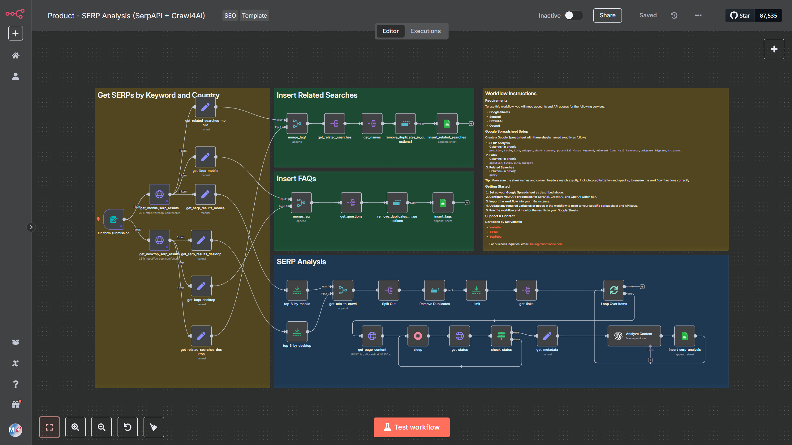
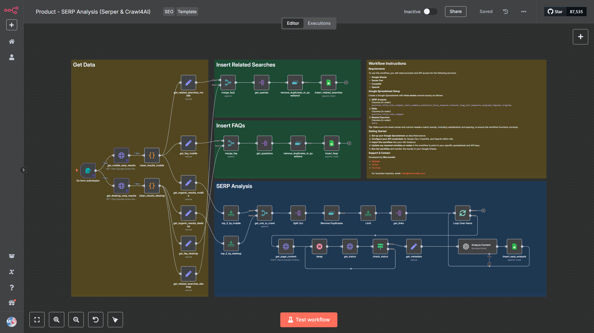

# SERP Analysis Automation Template

Free n8n templates to automate SERP analysis and save time on keyword research and competitor analysis. You can find a demo [here](https://youtu.be/DEG9-EZYyUM).

## Overview

This template was created to simplify the process of content creation for websites. By automating SERP analysis, it saves at least 30 minutes per article, depending on the complexity of the topic. It streamlines keyword research and competitor analysis, making it an essential tool for content creators. 

## Versions
### SerpApi + Crawl4AI

### Serper + Crawl4AI

### Serper + Firecrawl

## What These Templates Do

- **Focus Keyword Input**: Provide a simple form to enter your focus keyword and target country
- **SERP Data Fetching**: Uses SerpAPI / Serper to fetch organic results, related searches and FAQs for both mobile and desktop
- **Top Results Analysis**:
  - Captures the top 3 results for each device type (adjustable)
  - Crawls the content of each result using `crawl4ai` / `firecrawl`
- **Content Analysis**:
  - Analyzes crawled content with an LLM (currently using GPT-4o-mini for cost efficiency, but you can replace it by any other LLM)
  - Generates:
    - Article summaries
    - Potential focus keywords
    - Relevant long-tail keywords
    - N-gram analysis (when sufficient content is available)
- **FAQ Extraction**: Fetches FAQs from search results.
- **Related Searches**: Extracts related searches from the given search engine based on your focus keyword
- **Data Storage**: Saves all data to Google Sheets for easy access and further analysis.

## Customization

Feel free to customize this template to suit your specific needs. During testing, it is recommended to:
- Use limits to control the amount of data fetched.
- Pin data to save tokens and SerpAPI / Serper / Firecrawl credits.

## Recommendation

I am using a template that works with Serper and Crawl4AI. This is by far the most cost-effective solution I have found so far. The drawback is that you have to set up Crawl4AI. If you want to get started quickly, I recommend using the templates that use Serper and Firecrawl. This is definitely the fastest way to start analyzing SERP results. The only drawback is that you have to pay for Firecrawl.
