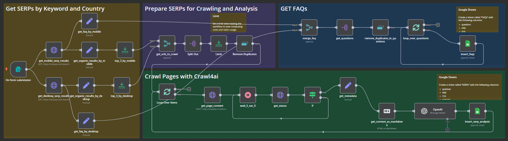

# SERP Analysis Automation Template

A free n8n template to automate SERP analysis and save time on keyword research and competitor analysis. You can find a demo [here](https://youtu.be/DEG9-EZYyUM).

## Overview

This template was created to simplify the process of content creation for websites. By automating SERP analysis, it saves at least 30 minutes per article, depending on the complexity of the topic. It streamlines keyword research and competitor analysis, making it an essential tool for content creators. 

## What This Template Does

- **Focus Keyword Input**: Provides a simple form to enter your focus keyword and target country.
- **SERP Data Fetching**: Uses SerpAPI to fetch organic results and FAQs for both mobile and desktop.
- **Top Results Analysis**:
  - Captures the top 3 results for each device type (adjustable).
  - Crawls the content of each result using `crawl4ai`.
- **Content Analysis**:
  - Analyzes crawled content with an LLM (currently using GPT-4o-mini for cost efficiency).
  - Generates:
    - Article summaries
    - Potential focus keywords
    - Relevant long-tail keywords
    - N-gram analysis (when sufficient content is available)
- **FAQ Extraction**: Fetches FAQs from search results.
- **Data Storage**: Saves all data to Google Sheets for easy access and further analysis.

## Customization

Feel free to customize this template to suit your specific needs. During testing, it is recommended to:
- Use limits to control the amount of data fetched.
- Pin data to save tokens and SerpAPI credits.
