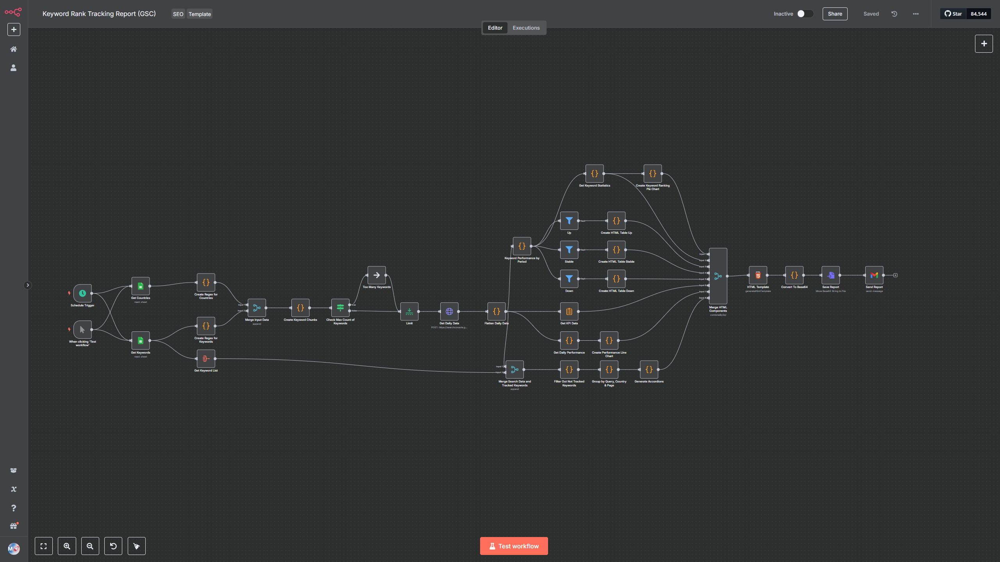
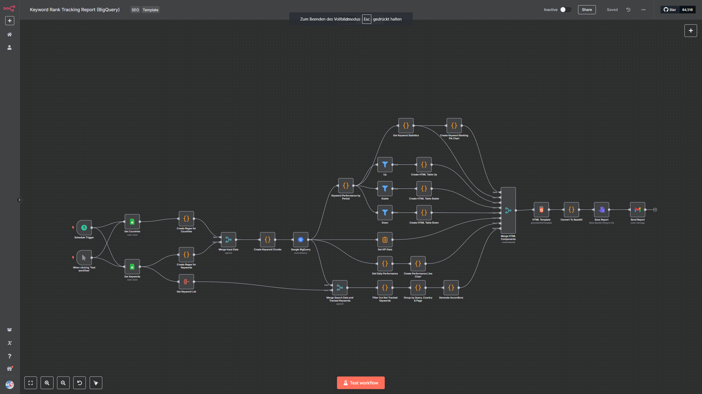

# Automated Keyword Performance Reports (For Purchase)

This automation automatically generates interactive SEO performance reports and delivers them directly to your mailbox or your clients. The workflow allows you to track multiple keywords across various countries according to your needs. Unlike other SEO tools that only show the top-ranking page for a keyword, this solution displays all pages ranking for your target keywords. Due to this feature, you will be able to identify if your pages are competing with each other (keyword cannibalization).

### 📊 [View Example Report](./n8n-keyword-rank-tracking-example-report.html)

## Automation Template with Google Search Console API Integration 

## Automation Template with BigQuery integreation

## Report Structure

### Overview
The overview section presents key performance indicators (KPIs) including:
- Total keywords tracked
- Total clicks
- Total impressions
- Average CTR (Click-Through Rate)

Additionally, the report visualizes the performance of your improved, stable, and declined keywords through both line charts and pie charts.

### Keyword Analysis
This section helps you monitor keywords that have:
- Improved in rankings
- Maintained stable positions
- Declined in rankings

Each category has its dedicated tab. The tables include detailed properties such as:
- Keyword
- Country
- Previous position
- Current position
- Position change
- Clicks
- Impressions
- CTR
- Ranking page URL

**Note:** You may notice more keywords than initially targeted. This is because the automation that works with the Google Search Console API uses regex patterns to filter Google Search Console data, enabling you to discover related keywords similar to your target terms.

### Performance of Tracked Keywords
This section provides detailed ranking information for your selected keywords. Each accordion entry includes:
- Keyword
- Country
- Page URL
- Position with trend indicator
- Clicks
- Impressions
- Average CTR
- Current position

Every keyword's performance is visualized through an interactive line chart for better understanding.

## Additional Features

- Mobile-responsive design
- Customizable root styling for CI/CD integration
- Custom favicon support
- Logo integration
- Navigation header with section links
- Footer
