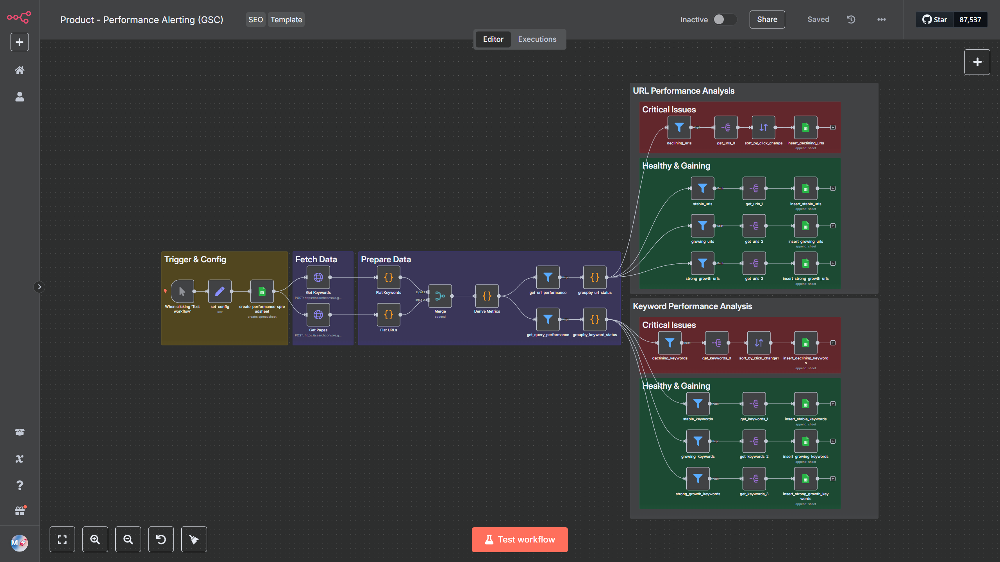
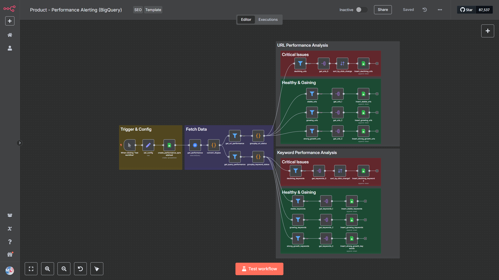
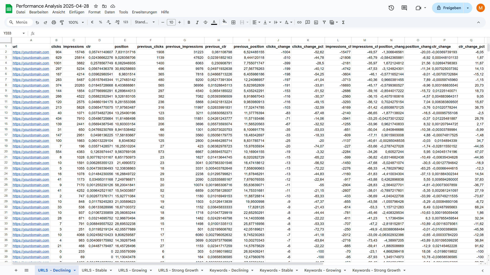
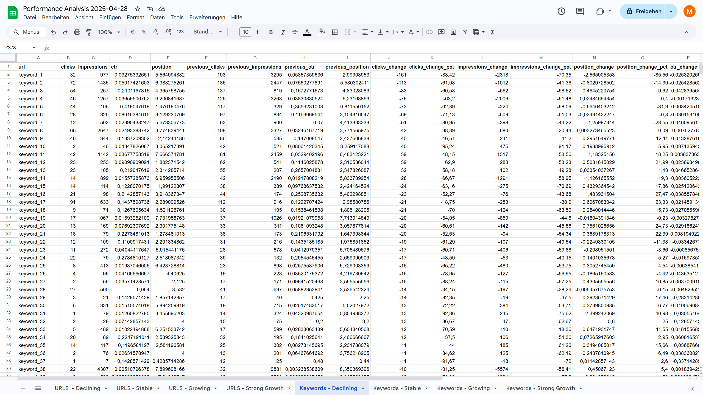

# n8n Website Performance Analysis Workflow

**Get instant, actionable insights into your website’s performance—no technical skills required.**  
These n8n templates connect directly to Google Search Console and BigQuery, making it easy to discover which pages and keywords are driving your traffic, spot trends, and identify new opportunities for growth. Forget manual data analysis and start making smarter, data-driven decisions to boost your organic results. You can find the bundle [here](https://marvomatic.com/products/n8n-website-performance-analysis-workflow/).

## 🚀 Key Features

- **Google Search Console API Integration:**  
  Connect directly to your own Google Search Console data for accurate, first-party insights and start using the workflow immediately.

- **BigQuery Integration:**  
  Analyze even the largest websites by connecting to your own BigQuery tables, bypassing Google Search Console’s row limits for advanced, large-scale data analysis.

- **Automatic Categorization:**  
  Instantly see which pages and keywords are Declining, Stable, Growing, or experiencing Strong Growth, so you can focus your efforts where they matter most.

- **Period-over-Period Analysis:**  
  Effortlessly compare performance across different time periods to spot trends, recover lost traffic, and capitalize on new opportunities.

- **Google Sheets Export:**  
  All results are automatically saved to a Google Spreadsheet, making it easy to review, share, and collaborate with your team or clients.

- **Minimal Costs:**  
  Both Google Search Console API and BigQuery offer generous free tiers, making this a powerful and affordable solution for everyone.

## 📊 What's Inside?

- **Website Performance Analysis Template (Google Search Console API):**  
  Instantly access and analyze your most important SEO metrics.
    
- **Website Performance Analysis Template (BigQuery):**  
  Handle extensive datasets and unlock deeper insights for large or growing websites.
    
- **Performance Analysis for Pages:**  
  Identify high-impact pages that need attention or are driving growth.
    
- **Performance Analysis for Keywords:**  
  Quickly spot which keywords are losing traction and which are on the rise.
    

## ❓ Questions? Get in Touch Before You Buy!

If you have any questions or need clarification before purchasing, **don’t hesitate to contact me directly**. Digital products are non-refundable, so I strongly encourage you to reach out with any concerns or specific questions you may have. The more detailed your inquiry, the better I can help you determine if this workflow is the perfect fit for your needs.

**Contact me anytime via [hello@marvomatic.com](mailto:hello@marvomatic.com). I’m here to help!**

